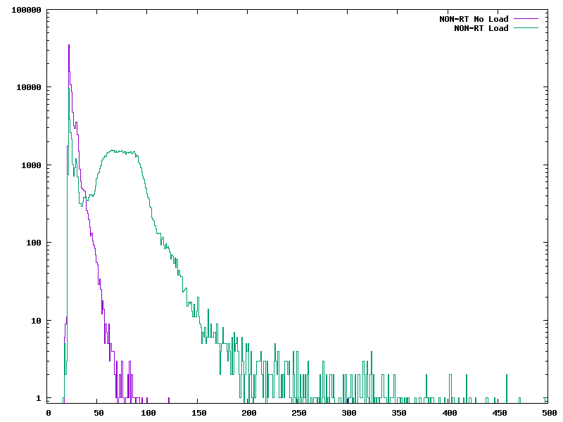
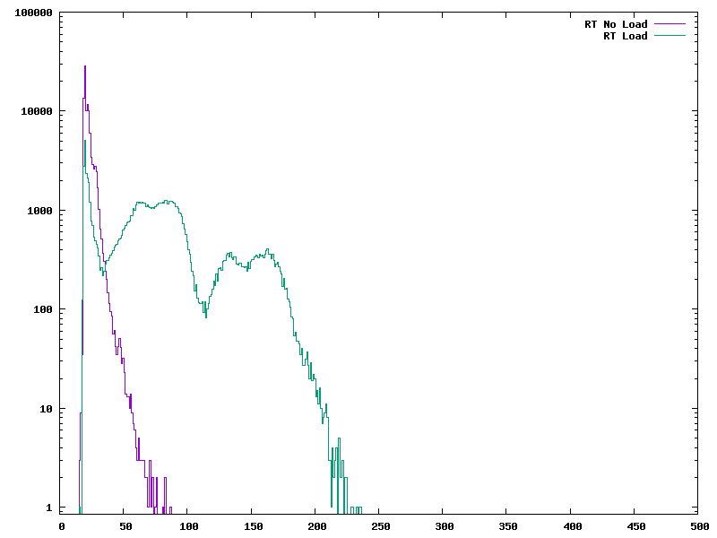

# HW06

This folder contains the deliverables for Homework 6 of ECE434

## Question Answers

1. Where does Julia Cartwright work?
National Instruments

2. What is PREEMT_RT? Hint: Google it.
Having completely bounded latencies. It does what its expected to do in the time that its expected to do it.

3. What is mixed criticality?
When a system has multiple tasks that are made up of different levels of criticality

4. How can drivers misbehave?
The driver stacks are shared. 

5. What is Δ in Figure 1?
Real time latency

6. What is Cyclictest[2]?
A test designed to benchmark real-time systems. It measures the difference between a threads intended wake-up time and the time it actually wakes up. 

7. What is plotted in Figure 2?
The difference between a real time and nonrt kernel. And howthe rt kernel has a bounded latency of 16us

8. What is dispatch latency? Scheduling latency?
Dispatch: the time between the hardware event occurring and the relevant interrupt being woken up
Scheduling: the time that it takes for the cpu to be given the task after it has been recognized

9. What is mainline?
The standard kernel process. It waits for any interrupt to complete before moving the the next

10. What is keeping the External event in Figure 3 from starting?
The kernel needs to wait for the non-critical event that had already started to finish running first. Main contributor to dispatch latency

11. Why can the External event in Figure 4 start sooner?
Because only a very small portion of the execution is performed in hardirq so the latency/bounds of that portion can be very well understood. The these shims wake up a necessary thread that is run so when an important interrupt comes up the appropriate event can be triggered faster.

## Plots 

The plots are named RT.png and NONRT.png. To create a load I ran the make command in the modules directory

The RT kernel definitely stiffles the continued ripples that you can see in the NON-RT.

### NONRT.png

### RT.png

# hw06 grading

| Points      | Description |
| ----------- | ----------- |
|  2/2 | Project 
|  5/5 | Questions
|  4/4 | PREEMPT_RT
|  2/2 | Plots to 500 us
|  3/5 | Plots - Heavy/Light load | *Show RT and non-RT on same plot*
|  2/2 | Extras
| 18/20 | **Total**

*My comments are in italics. --may*

